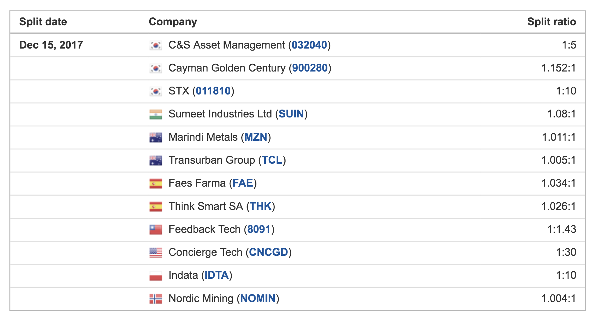

# Stock Split Calendar (Python)
Python interface to www.investing.com/stock-split-calendar/

<p align="center">
  <br/>
  <i>Stock split calendar for 2017/12/15.</i>
</p>

This translates to:
```
2017-12-15
-      C&S Asset Management                      032040                south_korea           1:5
-      Cayman Golden Century                     900280                south_korea           1.152:1
-      STX                                       011810                south_korea           1:10
-      Sumeet Industries Ltd                     SUIN                  india                 1.08:1
-      Marindi Metals                            MZN                   australia             1.011:1
-      Transurban Group                          TCL                   australia             1.005:1
-      Faes Farma                                FAE                   spain                 1.034:1
-      Think Smart SA                            THK                   spain                 1.026:1
-      Feedback Tech                             8091                  taiwan                1:1.43
-      Concierge Tech                            CNCGD                 usa                   1:30
-      Indata                                    IDTA                  poland                1:10
-      Nordic Mining                             NOMIN                 norway                1.004:1
```
